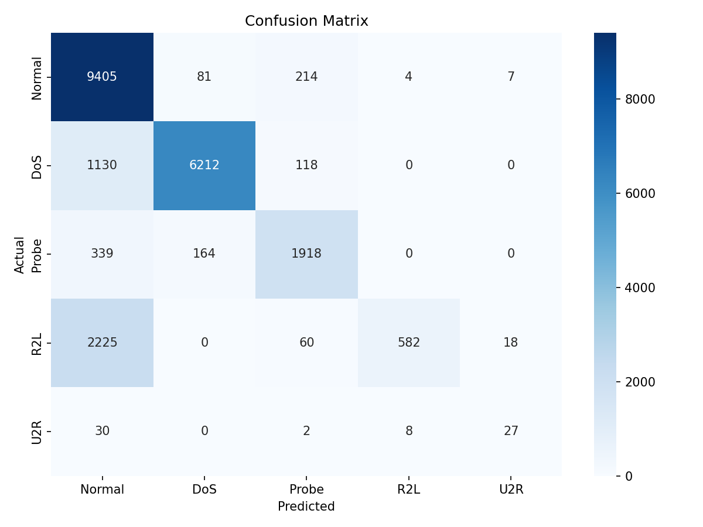

# Assignment Report Example

---

**Course:** Advanced Python (ICS0019)

**Team members:** Austin Robert Derck, Sebastian Alberto Parra Pinto

**Date:** 25.05.2026

Repository link: https://gitlab.cs.ttu.ee/austid/ml_training (please email me at austid@taltech.ee if you can't access the repository, it should be visible to all internal accounts)

---

## 1. Approach

### 1.1 Strategy Overview

We started by identifying the library with the most examples and best documentation which seemed to point towards XGBoost. Once we had a working implementation and F1 scores in the 54-58 range we moved on to implementing SMOTE which immediately saw a boost of ~10 on F1.

### 1.2 Preprocessing

Describe any changes you made to the data beyond the starter code:

- **Feature engineering:** None applied beyond starter code
- **Feature selection:** Dropped num_outbound_cmds 
- **Scaling:** None applied,XGBoost does not require feature scaling
- **Other:** Categorical features (protocol_type, service, flag) were label encoded. Attack types were mapped to 5 numeric categories (0=Normal, 1=DoS, 2=Probe, 3=R2L, 4=U2R)

### 1.3 Class Imbalance Handling

How did you address the imbalance between classes?

- **Method used:** SMOTE
- **Parameters:** k_neighbors=5
- **Effect on training set distribution:** Went from heavily imbalanced Normal > DoS > Probe > R2L > U2R to more even distribution across all.

---

## 2. Experiments

### Total number of experiments: 5

### Experiment 1:  Default params

- **Algorithm:**  XGBoost
- **What changed from baseline:** Our own baseline run with default parameters (n_estimators=100, max_depth=6, learning_rate=0.3, subsample=1)
- **Macro F1 (CV):**  0.9447 (± 0.0127)
- **Macro F1 (test):**  0.5600200543620495
- **Observation:**  Already beats the Random Forest baseline of 0.47. However R2L and U2R detection is still poor due to class imbalance.

### Experiment 2: Tuned params 

- **Algorithm:** XGBoost    
- **What changed:** Increased n_estimators to 200, reduced learning_rate to 0.1, reduced subsample to 0.8
- **Macro F1 (CV):** 0.9433 (± 0.0180)
- **Macro F1 (test):** 0.5741628324208399
- **Observation:** Small but consistent improvement. Lower learning rate with more trees generalizes better.

### Experiment 3: SMOTE + default params
- **Algorithm:** XGBoost + SMOTE
- **What changed:** Applied SMOTE oversampling to the training data before training (default model params: n_estimators=100, max_depth=6, learning_rate=0.3, subsample=1). SMOTE raised every class to 67,343 training examples.
- **Macro F1 (CV):** 0.9998 (± 0.0001)
- **Macro F1 (test):** 0.6320434249728675
- **Observation:** Best result so far. R2L recall improved from 0.05 to 0.16 and U2R recall from 0.16 to 0.25. The near-perfect CV score (0.9998) is misleading, it happens because SMOTE's synthetic samples leak across cross-validation folds, so CV is not a reliable estimate here.

### Experiment 4: SMOTE + tuned params
- **Algorithm:** XGBoost + SMOTE
- **What changed:** Combined SMOTE with Experiment 2's tuned parameters (python ml_training.py -n 200 -d 6 -l 0.1 -s 0.8)
- **Macro F1 (CV):** 0.9997 (± 0.0001)
- **Macro F1 (test):** 0.6415187059675862
- **Observation:** Best result so far. Combining SMOTE with tuned parameters improved the test macro F1 over both the no-SMOTE runs and the SMOTE+default run. R2L recall reached 0.18 and U2R recall 0.31. The CV score (0.9997) remains inflated due to SMOTE samples leaking across cross-validation folds.

### Experiment 5: SMOTE + fine-tuning
- **Algorithm:** XGBoost + SMOTE
- **What changed:** More fine-tuning parameters with smaller adjustments applied in sets of parameters to observe interactions (python ml_training.py -n 200 -d 4 -l 0.08 -s 0.95)
- **Macro F1 (CV):** 0.9992 (± 0.0002)
- **Macro F1 (test):** 0.6630232649262691
- **Observation:** Best overall result combining adjustments across all parameters. Reducing learning rate from 0.1 to 0.05 showed improvement while adjusting back up to 0.08 feels like it provided the best granularity. Surprisingly n_estimators remained most effective at around 200.

### Experiments Summary

| # | Description            | Algorithm        | Imbalance Handling | Macro F1 (CV) | Macro F1 (test)     |
|---|------------------------|------------------|--------------------|---------------|---------------------|
| 1 | Default params         | XGBoost          | None               | 0.9447        | 0.5600200543620495  |
| 2 | Tuned params           | XGBoost          | None               | 0.9433        | 0.5741628324208399  |
| 3 | SMOTE + default params | XGBoost + SMOTE  | SMOTE              | 0.9998        | 0.6320434249728675  |
| 4 | SMOTE + tuned params   | XGBoost + SMOTE  | SMOTE              | 0.9997        | 0.6415187059675862  |
| 5 | SMOTE + fine-tuning    | XGBoost + SMOTE  | SMOTE              | 0.9992        | 0.6630232649262691  |

---

## 3. Final Results

### 3.1 Best Model

- **Algorithm:** XGBoost
- **Key parameters:** n_estimators=200, max_depth=4, learning_rate=0.08, subsample=0.95
- **Imbalance handling:** SMOTE
- **Feature engineering:** None

### 3.2 Final Macro F1-Score

| Metric              | Score              |
|---------------------|--------------------|
| **Macro F1 (test)** | 0.6630232649262691 |
| Macro F1 (CV)       | 0.9992 (± 0.0002)  |

### 3.3 Classification Report

| Category | Precision | Recall | F1-Score | Support |
|----------|-----------|--------|----------|---------|
| Normal   | 0.72      | 0.97   | 0.82     | 9711    |
| DoS      | 0.96      | 0.83   | 0.89     | 7460    |
| Probe    | 0.83      | 0.79   | 0.81     | 2421    |
| R2L      | 0.98      | 0.20   | 0.33     | 2885    |
| U2R      | 0.52      | 0.40   | 0.45     | 67      |

### 3.4 Confusion Matrix

## 4. Cross-Validation vs. Test Score

- **CV macro F1:**  0.9992 (± 0.0002)
- **Test macro F1:** 0.6630232649262691
- **Gap:** 0.3361767350737309

**Analysis:** Our CV score is higher than our test score. This is because we applied SMOTE to the whole training set before cross-validation, so the synthetic examples ended up in both the training and validation folds, the model was tested on data very similar to what it trained on, so this inflated the CV score. Some gap is also expected because KDDTest+ contains attack types not present in the training data.

## 5. What Worked and What Didn't

### What had the biggest positive impact?

SMOTE raised macro F1 score by ~10 running with the same parameters.

### What surprisingly didn't help?

Setting higher n_estimators rarely helped. Setting 200 over 100 had small gains as anything less seemed to be too few rounds however it quickly fell off again with even 300-400 dropping overall.

### What would you try with more time?

Deeper feature engineering; we were never able to successfully implement scale_pos_weight as it was always disregarded during model training.

---

## Appendix: Environment

- **Hardware:** i7-11800H, 16GB, NVIDIA T1200 - Ryzen-9 9955HX, RTX 5060 8GB
- **Python version:** 3.14.5
- **Key libraries:** xgboost, sklearn
- **Random seed:** 42